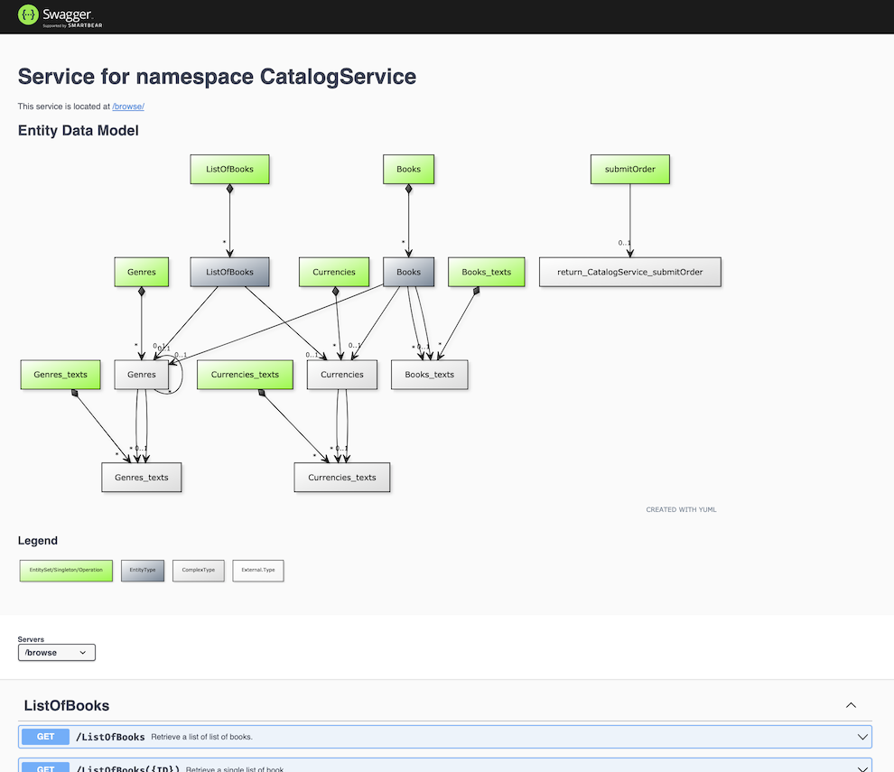

# cds-swagger-ui-express

An express middleware to serve OpenAPI definitions for [CAP](https://cap.cloud.sap) services in Swagger UI.
Builds on top of [swagger-ui-express](https://www.npmjs.com/package/swagger-ui-express).



## Installation

In your project, execute
```sh
npm install --save-dev cds-swagger-ui-express
```

## Usage

Have this in your [`server.js`](https://cap.cloud.sap/docs/node.js/cds-server#custom-server-js):

```js
const cds = require ('@sap/cds')
const cds_swagger = require ('cds-swagger-ui-express')

cds.on ('bootstrap', app => app.use(cds_swagger()) )

module.exports = cds.server
```

Swagger UI is then served on `/$api-docs/<service-path>`, like http://localhost:4004/$api-docs/browse/

## Configuration

Call `cds_swagger ({...})` with the following object:
```jsonc
{
  "basePath": "/$api-docs", // the root path to mount the middleware on
  "diagram": "true" // whether to render the YUML diagram
}
```

### Notes

If you call [`cds.serve`](https://cap.cloud.sap/docs/node.js/cds-serve#cds-serve) on your own in your `server.js`, make sure to install this middleware _before_, as it relies on CDS' [`serving` events](https://cap.cloud.sap/docs/node.js/cds-server#cdson--serving-service).
